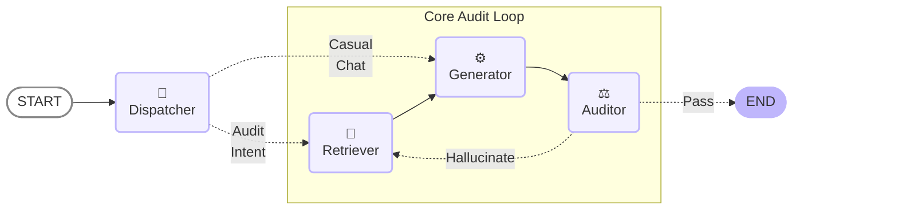
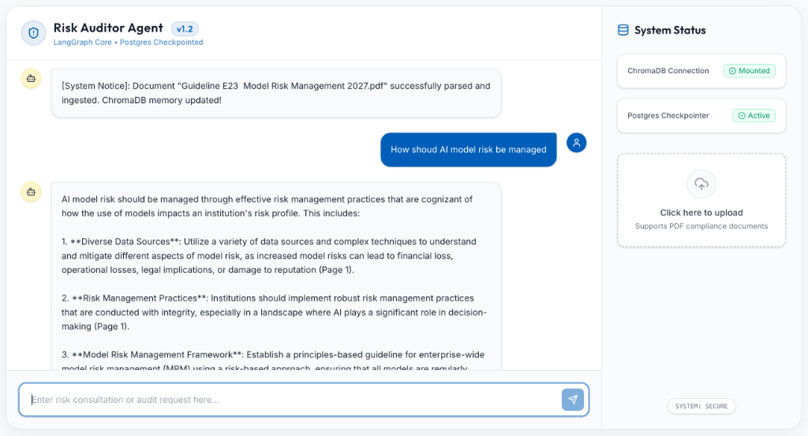

# 🛡️ Risk Auditor Agent (AIXel Case Assignment)
[](#)
[](#)
[](#)
[](#)
[](#)

An enterprise-grade, Multi-Agent Risk Management Assistant designed to parse, query, and enforce compliance parameters (e.g., OSFI Guideline E-23) utilizing a decoupled microservice architecture.

## 🌟 Core Technologies & Features

1. **Stateful Agentic Graph (LangGraph)**
   The core reasoning engine operates as a finite state machine rather than a linear chain. It utilizes a `PostgresSaver` checkpointer tied to user session IDs (`thread_id`), allowing true persistent conversational memory across server restarts.

2. **Contextual RAG & Query Expansion**
   Overcomes traditional dumb-retrieval limitations. A secondary LLM node evaluates chat history, resolves pronouns (e.g. "what does _it_ mean?"), and rewrites queries into explicitly detailed search terms before hitting the vector database.

3. **Self-Correction Hallucination Loop (Logic Auditor)**
   Features a strict, dedicated "Judge Node". Before presenting any risk-control answer to the user, the Logic Auditor evaluates the LLM's response against the raw ChromaDB context. If it detects unverified hallucinations, it generates a scathing feedback rejection and forces the retrieving agent to correct itself (with a hard circuit-breaker to prevent infinite loops).

4. **Decoupled Microservice Architecture**
   Vector embeddings run locally via `HuggingFaceEmbeddings(all-MiniLM-L6-v2)` piped directly into a standalone `ChromaDB` Docker container. Application state is handled by a separate `Postgresql` instance.

5. **Premium Cyberpunk Glassmorphism UI**
   A dual-pane web application built on Vite + React + TailwindCSS v4 with drag-and-drop document upload and fluid micro-animations.

## 🗂️ Repository Structure

```text
.
├── backend                      # Python backend service (FastAPI)
│   ├── app
│   │   ├── main.py              # FastAPI entrypoint & HTTP routes
│   │   ├── config.py            # Pydantic environment configuration, to avoid loading .env multiple times
│   │   ├── prompts.py           # Core prompt templates for LLMs，separated for latter prompt engineering
│   │   └── services
│   │       ├── agent.py         # LangGraph state machine & AI logic
│   │       ├── database.py      # PostgreSQL checkpointer
│   │       └── vector_store.py  # ChromaDB semantic retrieval
│   ├── Dockerfile               # Backend container definition
│   └── tests                    # Pytest testing suite
├── frontend                     # React web application (Vite)
│   ├── src
│   │   ├── App.jsx              # Main UI interface
│   │   ├── App.css              # styling
│   │   └── index.css            # styling
│   ├── Dockerfile               # Frontend container definition
│   └── nginx.conf               # NGINX configuration
└── docker-compose.yml           # Orchestrates the entire stack (Chroma, Postgres, Redis, etc.)
```

## ⚙️ AI Agent Workflow (LangGraph)

The internal reasoning engine leverages cyclical state machines rather than linear chains to achieve self-reflection and hallucination prevention.



## 🚀 Quick Start

The entire application stack (Frontend, Backend, Postgres, ChromaDB, Redis) is completely containerized. You do not need to install Node or Python locally.

### 1. Configure Environment
Create a `.env` file in the root directory and add your OpenRouter API key:
```bash
OPENROUTER_API_KEY="your-api-key"
LANGCHAIN_API_KEY="your-api-key" # optional
```

### 2. Start the Stack 
**Note**: do not forget to start the docker daemon in your local machine
```bash
# Spins up the entire microservice ecosystem in the background
docker compose up -d --build
```

### 3. Access the Application
- **Frontend UI**: `http://localhost:5173`
- **Backend API Docs**: `http://localhost:8000/docs`
- **PGAdmin (DB Viewer)**: `http://localhost:8080`
- **LangSmith**: `https://smith.langchain.com/`



## 📊 Observability & Telemetry (LangSmith)

To enable zero-code enterprise-grade tracing (Token usage, Latency tracking, and Node trace trees), this repository has native support for LangSmith telemetry:
1. Create a free account at [Langchain Smith](https://smith.langchain.com/) and generate an API key.
2. Edit your local `.env` file to include the telemetry flags:
```bash
LANGCHAIN_TRACING_V2="true"
LANGCHAIN_API_KEY="lsv2_pt_your_api_key_here..."
```
3. Restart the background stack with `docker compose up -d`. All AI reasoning loops will now stream live to your cloud dashboard.

## 🏢 FAQ (Architecture Decisions)

### 1. What are the key features in the system?
- **Self-Reflective AI-as-a-Judge**: A native Maker-Checker framework where an isolated `auditor_node` relentlessly checks generated drafts against context to physically mathematically reduce hallucination rates to near zero.
- **Adaptive Intent Routing**: Automatically categorizes user intents to bypass heavy RAG DB queries for casual chats, ensuring zero wasted compute for non-domain interactions.
- **Advanced Contextual Query Expansion**: Features an active "Pronoun Resolution" module that rewrites user follow-up questions intelligently using previous memory state before hitting the RAG layer.
- **Disaster-Resilient Caching & Failover**: Embedded Langchain routing that seamlessly falls back to backup LLM pipelines (e.g. Claude) upon primary LLM (e.g. GPT-4o) failure without bubbling HTTP 500 errors to the frontend.

### 2. What are the major components in the system?
- **The Agentic Orchestration Brain (LangGraph)**: The cyclic state machine routing logic among Dispatcher, Retriever, Generator, and Auditor nodes.
- **The API Gateway (FastAPI)**: The asynchronous web backbone carrying the persistent server lifespan, LLM caches, and backend HTTP endpoints.
- **The Semantic Knowledge Engine (ChromaDB)**: Containerized local microservice for HNSW Top-K density vector search, completely removed from external API query wait times.
- **The State Persistence Plane (PostgreSQL)**: The transactional ACID safety-net tracking deep conversation trees and checkpoints.
- **The CI/CD Safeguard (Pytest + Github Actions)**: Utilizing an automated "Red-Teaming Robot" that simulates prompt injections (jailbreaks) continuously during code deployments to prevent regressed LLM behavior.

### 3. Why did you choose this specific way to handle memory?
Memory is managed by **LangGraph's AsyncPostgresSaver**. The system relies on this over simple in-memory arrays for 3 critical reasons:
1. **Stateless Scalability**: Permits scaling FastAPI horizontally across instances without "amnesia" since states exist on PG.
2. **Prerequisite for HITL**: Freezing an execution loop and waking it up hours later based solely on the tuple `(thread_id, state_checkpoint)` stored in Postgres is required for asynchronous Human-In-The-Loop approvals. 
通常的 AI 聊天脚本是靠 Python 内存里的 Array 数组来硬存对话历史，这在企业级生产里是不可接受的，只要服务器一重启，所有的 AI 都会失忆。
我引入了 PostgresSaver 这个数据旁路拦截器。每一次 AI 节点之间的转折（Checkpoints），它的完整思维切片都会被异步持久化写入 PostgreSQL。这不仅打破了 FastAPI 进程不能横向扩展的隐患，更为将来实现基于同一 thread_id 的 Human-in-the-Loop（合规专员人工切入修改图谱状态，再让它继续运行）铺平了道路。”
3. **Structured Audit Trails**: Beyond simple chat logs, Postgres natively preserves the 'inner cognitive state' of the agent (retry counts, flagged hallucination boolean flags), providing indisputable historical evidence required in physical legal/compliance audits.

### 4. How did you ensure the system is fast?
- **Asynchronous I/O Concurrency**: All FastAPI nodes and API wait cycles operate over Python's non-blocking Event Loops, driving simultaneous query throughput capacity.
- **Pre-Emptive Routing Bypasses**: Routine inputs completely skip the heavy chunked Semantic Retrieval stage resulting in zero computation bloat.
- **Sub-Millisecond Dense Local Search**: Leveraging `all-MiniLM-L6-v2` locally mapped within Docker keeps network-hop induced latency to absolute minimal levels.

### 5. How did you ensure the system is stable?
- **High-Availability Fallbacks**: `with_fallbacks()` routes ensure model API downtime (429/500s) does virtually zero damage to application uptime.
- **Resilient Redis Caching (Thundering Herd Protection)**: Actively intercepts and returns semantically exact queries from cache memory to guard fragile OpenAI rate limits from breaking under mass concurrent usage.
- **Circuit Breakers**: Graph recursions enforce strict multi-cycle limits (`retry_count > 3`) physically preventing infinitely cycling LLM hallucinatory deadlocks. 

### 6. What would you do differently if you had a month instead of three days?
If granted a one-month roadmap, I would evolve this prototype into a complete Enterprise Swarm:
1. **Advanced GraphRAG Migration**: Deprecate crude chunking for Knowledge Graph parsing crossed with a dedicated `Cohere Re-ranker` to achieve true Top-K deterministic reasoning across hyper-scattered documentation.
2. **TTFT-Optimized SSE Streaming**: Refactor `ainvoke()` endpoints into pure websockets / `astream_events()`, drastically slashing 'Time-to-First-Token' wait anxiety in the frontend.
3. **RLHF via HITL Logs**: Re-invest all human overrides and auditor rejection checkpoints into a continuous Direct Preference Optimization (DPO) pipeline, effectively creating a self-healing localized fine-tuned LLM policy.
4. **Multi-Agent Federation**: Dissolve the monolithic graph into explicitly disparate Swarm Agents (Legal Agent, Accounting Agent, Manager Agent) isolated via strict RBAC (Role-Based Access Controls).
